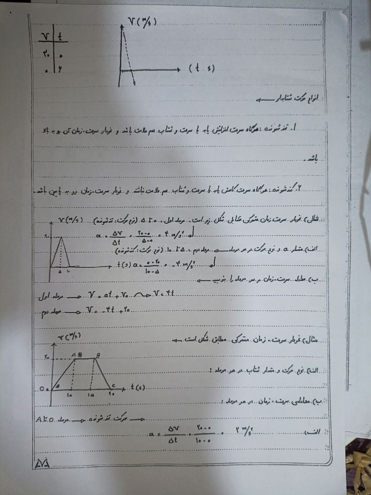
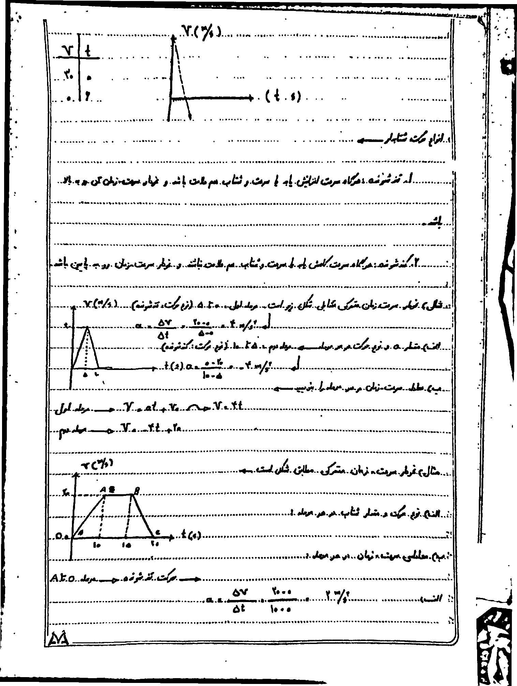
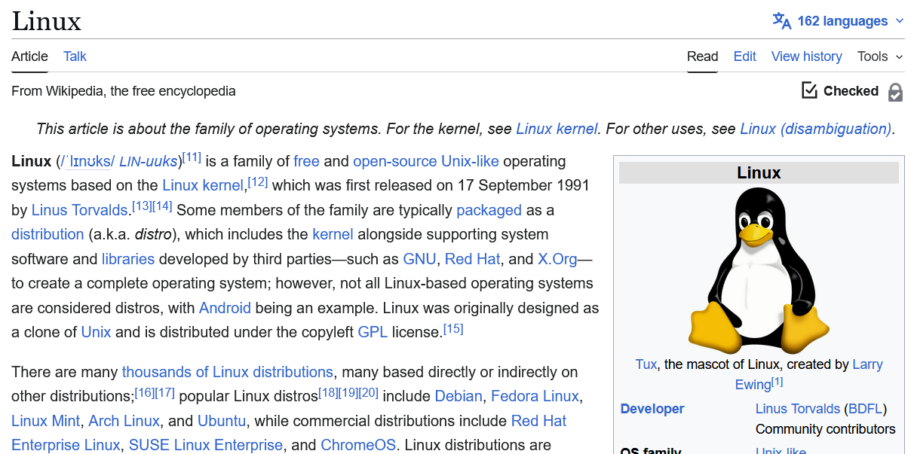

<div align="center">

# Image Enhancement Model for OCR

**A lightweight, fully automatic image preprocessing pipeline that turns low-quality, hand-photographed documents into clean, OCR-ready scans — without any machine learning models.**

[](https://www.python.org/)
[](https://opencv.org/)
[](https://numpy.org/)
[](LICENSE)
[]()

</div>

---

## What is it?

Most OCR engines fail on real-world document photos: shadows across the page, a tilted camera, low resolution, uneven phone flash lighting. This module solves all of that in a single pipeline call.

Feed it a photo. Get back a clean, high-contrast, deskewed document image ready for any OCR engine — Tesseract, EasyOCR, PaddleOCR, or your own model.

> Designed and optimised for **Persian/Arabic handwritten documents**, but works equally well on English, mixed-language, printed, or typed documents.

---

## Before / After

### Persian Handwritten Physics Notes

| Input — raw phone photo | Output — OCR-ready |
|:-:|:-:|
|  |  |
| Tilted, uneven lighting, low contrast | Deskewed, white background, sharp text |

### English Printed Document

| Input | Output |
|:-:|:-:|
|  |  |
| Low contrast, shadow gradient | Clean, high-contrast, print-ready |

---

## Key Features

### Zero Configuration Required
Drop in any image. The pipeline **analyses the image automatically** and selects the right combination of steps and parameters. No tuning needed.

### Full Manual Control
Every single parameter can be overridden — either through CLI flags or a JSON config file. You always have the final say.

### No External Models
Built entirely on **OpenCV** and **NumPy**. No TensorFlow, no PyTorch, no downloaded weights. Runs on any machine with ~50 MB of disk space.

### Persian / Arabic First
Sauvola binarization with a carefully tuned threshold surface preserves the thin strokes and dots (*nuqta*) of Arabic-script handwriting without merging or breaking characters.

---

## Pipeline

Every image passes through up to 9 stages. Each stage is skipped automatically when the image doesn't need it.

```
Input Image
    │
    ▼
[1] Upscale          — Bicubic resize to ≥ 1500 px (up to 3×), skipped if already large
    │
    ▼
[2] Deskew           — Corrects camera/scanner tilt (Hough + Projection Profile, auto mode)
    │
    ▼
[3] Background Norm  — Removes shadows & uneven phone-flash lighting (morphological estimation)
    │
    ▼
[4] CLAHE            — Local contrast enhancement (Contrast Limited Adaptive Histogram EQ)
    │
    ▼
[5] Denoise          — Edge-preserving noise removal (Bilateral / NLM), skipped if image is clean
    │
    ▼
[6] Binarize         — Sauvola adaptive threshold (stable surface, preserves thin strokes)
    │
    ▼
[7] Cleanup          — Removes isolated noise dots via connected-component analysis
    │
    ▼
[8] Invert (opt.)    — White text on black background, if requested
    │
    ▼
Output Image
```

---

## Feature Details

### Smart Auto-Configuration
Before processing, the pipeline measures 6 image quality metrics:

| Metric | How it's measured | What it controls |
|---|---|---|
| **Noise level** | Laplacian variance | Denoising method & strength |
| **Lighting variation** | Std-dev of large Gaussian blur | Background normalisation on/off, CLAHE clip |
| **Contrast range** | 2nd–98th percentile spread | Background normalisation on/off |
| **Skew angle** | Hough lines median | Deskew correction |
| **Resolution** | Min(width, height) | Upscale factor & Sauvola window size |
| **Mean luminance** | Blurred mean | Dark-text vs light-text detection |

### Deskew — Two Methods, One Smart Mode
- **Hough** (`--deskew-method hough`): Fast. Uses `HoughLinesP` to find dominant line angles. Best for documents with clear horizontal/vertical strokes.
- **Projection Profile** (`--deskew-method projection`): Slower but robust. Sweeps rotation angles and maximises row-projection variance. Best for heavily skewed or sparse pages.
- **Auto** (default): Runs Hough first; if confidence is high, uses it directly. If uncertain, verifies with a narrow Projection search. Falls back to a full Projection sweep when Hough finds no dominant angle.

Supports corrections up to ±45°. Canvas expands to avoid clipping any content.

### Background Normalisation
Uses morphological dilation to estimate the local background (all ink strokes become "filled in"), then divides the original image by that estimate. Result: perfectly flat white background regardless of shadows, gradients, or coloured paper.

Works for both dark-text-on-light and light-text-on-dark documents.

### CLAHE — Adaptive Contrast
Unlike plain histogram equalisation, CLAHE operates on small tiles and clips the redistribution to avoid noise amplification. Clip limit is tuned automatically (2.0 → 3.5) based on measured lighting variation.

### Sauvola Binarization
Industry-standard adaptive threshold for handwritten documents:

```
T(x,y) = mean(x,y) × (1 + k × (std(x,y) / R − 1))
```

Our implementation computes the threshold surface on a **lightly blurred version** of the image to eliminate scatter artifacts from sensor noise, then compares **original** pixel values against that surface. This means:
- The threshold surface is spatially stable (no noise-induced scatter)
- Actual ink strokes are compared at full resolution (shape is preserved)

Window size is scaled automatically with image resolution (21–51 px). `k = 0.10` — tuned to keep Persian dots and thin strokes without merging them.

### Connected-Component Cleanup
After binarization, tiny isolated blobs (sensor dust, paper texture artifacts) are removed. Components touching the image border are always kept (they are likely real text cut off at the edge). No morphological dilation/erosion — strokes are never thickened.

---

## Installation

**Requirements:** Python 3.8 or newer.

```bash
pip install opencv-python numpy
```

Or from the requirements file:

```bash
pip install -r requirements.txt
```

**No other dependencies.** No model downloads. No GPU required.

### Minimum System Requirements

| Component | Minimum | Recommended |
|---|---|---|
| Python | 3.8 | 3.10+ |
| RAM | 512 MB | 2 GB |
| Disk | 60 MB (OpenCV) | — |
| CPU | Any x86-64 | Multi-core (NLM is CPU-bound) |
| GPU | Not required | Not used |
| OS | Windows / Linux / macOS | Any |

---

## Usage

### Fully Automatic (recommended)

```bash
python main.py photo.jpg output.png
```

The pipeline analyses `photo.jpg`, picks all settings automatically, and writes the enhanced image to `output.png`.

### Verbose Mode — See Every Step

```bash
python main.py photo.jpg output.png -v
```

```
  [enhance] Loading  photo.jpg
  [enhance] Input    1200x1600 px
  [enhance] Analysing image...
  [enhance] Metrics  noise=312  light_var=0.241  contrast=187  skew=2.3deg
  [enhance] Config   upscale=True  deskew=True  bg_norm=True  clahe=True  ...
  [enhance] Upscale  1200x1600 -> 1800x2400 (1.50x)
  [enhance] Deskew   corrected +2.3deg
  [enhance] BG-norm  ...
  [enhance] CLAHE    clip=2.5
  [enhance] Binarize sauvola  k=0.10  w=41
  [enhance] Cleanup  min_area=34px
  [enhance] Saved    output.png  (1800x2400 px)
```

### Analyse Without Processing

```bash
python main.py photo.jpg --analyse-only
```

```
=== Image Metrics ===
  Resolution      : 1200x1600 px
  Noise level     : 312.4  (medium)
  Lighting var    : 0.241  (moderate)
  Contrast range  : 187 / 255
  Skew angle      : +2.3deg  (needs correction)

=== Recommended Config ===
  upscale            : True  (target 1500px, max 2.5x)
  deskew             : True  (auto)
  normalize_bg       : True
  clahe              : True  (clip=2.5)
  denoise            : False  (bilateral)
  binarize           : True  (sauvola)
  sauvola_window     : 41
  sauvola_k          : 0.1
  morph_cleanup      : True  (min_area=34)
```

### Save to a Specific Directory

```bash
python main.py photo.jpg result.png --output-dir ./results/
```

### Override Individual Steps

```bash
# Force a specific binarization method
python main.py photo.jpg out.png --binarize sauvola

# Disable background normalisation
python main.py photo.jpg out.png --no-bg-norm

# Set Sauvola parameters manually
python main.py photo.jpg out.png --sauvola-window 35 --sauvola-k 0.12

# Disable deskew (document is already straight)
python main.py photo.jpg out.png --no-deskew

# Invert output (white text on black)
python main.py photo.jpg out.png --invert
```

### JSON Config File

Create a file `my_config.json`:

```json
{
  "deskew": true,
  "normalize_background": true,
  "clahe_clip_limit": 3.0,
  "denoise_method": "bilateral",
  "binarize_method": "sauvola",
  "sauvola_window": 35,
  "sauvola_k": 0.12,
  "morph_cleanup": true,
  "upscale": true,
  "target_min_dimension": 1800,
  "invert_output": false
}
```

```bash
python main.py photo.jpg out.png --config my_config.json
```

CLI flags always override JSON values.

---

## All CLI Options

```
python main.py <input> [output] [options]
```

| Flag | Description | Default |
|---|---|---|
| `input` | Path to input image | — |
| `output` | Output filename | — |
| `--output-dir DIR` | Directory for output file | Same as input |
| `--analyse-only` | Print metrics and exit | off |
| `--deskew` / `--no-deskew` | Enable/disable deskew | auto |
| `--bg-norm` / `--no-bg-norm` | Enable/disable background normalisation | auto |
| `--clahe` / `--no-clahe` | Enable/disable CLAHE | on |
| `--clahe-clip FLOAT` | CLAHE clip limit | auto (2.0–3.5) |
| `--denoise METHOD` | `nlm`, `bilateral`, `gaussian`, `none` | auto |
| `--binarize METHOD` | `sauvola`, `otsu`, `adaptive`, `none` | sauvola |
| `--sauvola-window INT` | Sauvola window size (pixels, odd) | auto (21–51) |
| `--sauvola-k FLOAT` | Sauvola k parameter | 0.10 |
| `--scale FLOAT` | Max upscale factor | auto |
| `--no-cleanup` | Disable connected-component cleanup | off |
| `--invert` | Invert output (white text on black) | off |
| `--config JSON` | Path to JSON overrides file | — |
| `-v` / `--verbose` | Print each processing step | off |

---

## Using as a Python Library

```python
from enhancer import ImageEnhancer

enhancer = ImageEnhancer(verbose=True)

result = enhancer.process(
    input_path="photo.jpg",
    output_path="output.png",
    user_overrides={
        "sauvola_k": 0.12,
        "normalize_background": True,
    }
)

if result["success"]:
    print("Done:", result["output_path"])
    print("Detected skew:", result["metrics"]["skew_angle"], "deg")
    print("Noise level:", result["metrics"]["noise_level"])
else:
    print("Error:", result["error"])
```

### Return Value

`process()` returns a dict:

```python
{
    "success": True,
    "output_path": "output.png",
    "config": <EnhancementConfig>,   # all parameters used
    "metrics": {
        "noise_level": 312.4,
        "lighting_variation": 0.241,
        "contrast_range": 187,
        "mean_luminance": 142.3,
        "min_dimension": 1200,
        "skew_angle": 2.3,
        "has_skew": True,
    }
}
```

---

## Project Structure

```
Image_enhancement_model/
│
├── main.py              — CLI entry point
├── enhancer.py          — Main pipeline orchestrator
├── config.py            — EnhancementConfig dataclass (all parameters)
├── auto_config.py       — Image analysis + automatic parameter selection
├── requirements.txt
│
└── processors/
    ├── deskew.py        — Hough & Projection-Profile skew correction
    ├── illumination.py  — Background normalisation + CLAHE
    ├── denoise.py       — NLM / Bilateral / Gaussian denoising
    ├── binarize.py      — Sauvola / Otsu / Adaptive binarization
    └── cleanup.py       — Connected-component noise removal
```

---

## Supported Input Formats

Any format OpenCV can read:

`JPEG` · `PNG` · `BMP` · `TIFF` · `WEBP` · `PPM` · `PGM`

---

## FAQ

**Q: Does it work on printed documents, not just handwriting?**  
Yes. The pipeline is agnostic to content type. It was tuned for handwriting but produces excellent results on printed pages, mixed pages, and even screenshots.

**Q: My document has a dark/coloured background. Will it work?**  
Yes. `normalize_background` auto-detects whether text is dark-on-light or light-on-dark and adjusts accordingly.

**Q: Can I run it on a batch of images?**  
Not built-in yet, but trivial to script:
```bash
for f in photos/*.jpg; do
    python main.py "$f" "results/$(basename $f .jpg).png"
done
```

**Q: How fast is it?**  
On a typical 1600×1200 photo on a modern CPU:
- Without NLM denoising: ~0.5–1.5 seconds
- With NLM denoising: ~3–8 seconds (NLM is the only slow step)

**Q: Why Sauvola instead of a neural binarizer?**  
No model files to ship, no GPU dependency, deterministic output, and Sauvola with correctly tuned parameters matches or beats neural binarizers on typical handwritten documents at a fraction of the complexity.

---

## License

MIT — free to use, modify, and distribute.

---

<div align="center">
Built with OpenCV · NumPy · Pure Python
</div>
<div align="center">
The code has been rewritten and the documentation written by AI!
</div>
